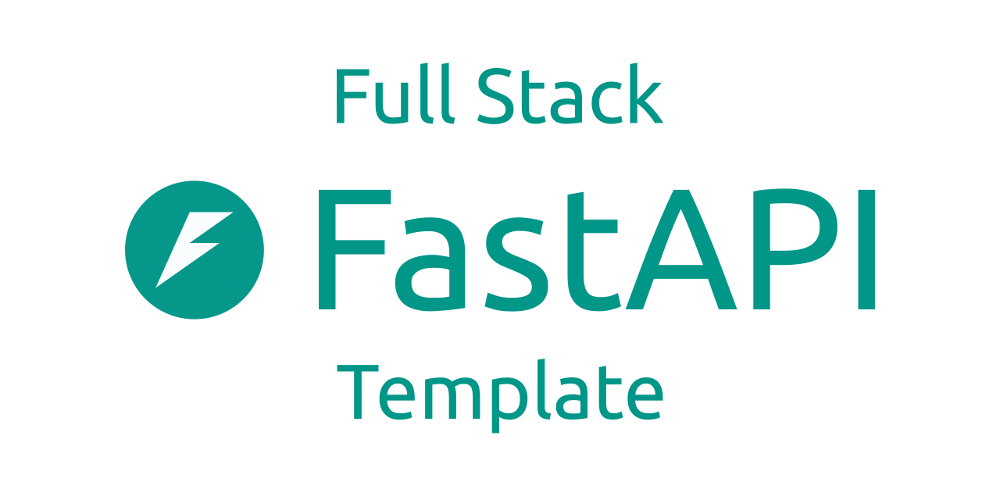
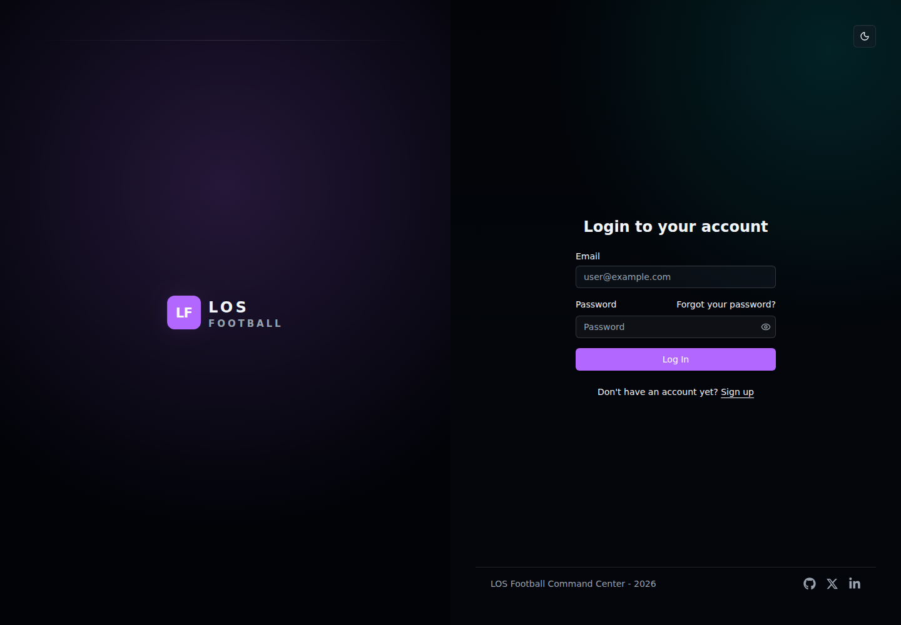
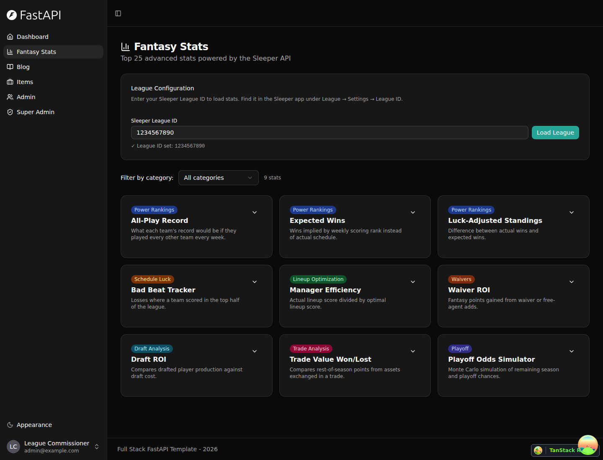
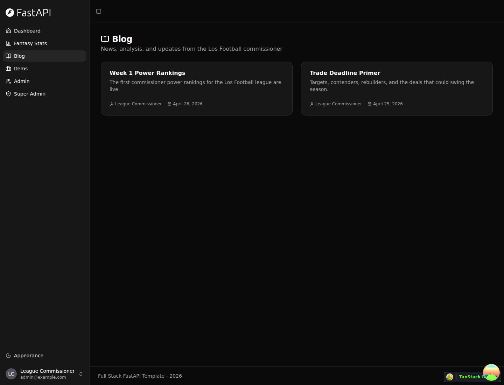
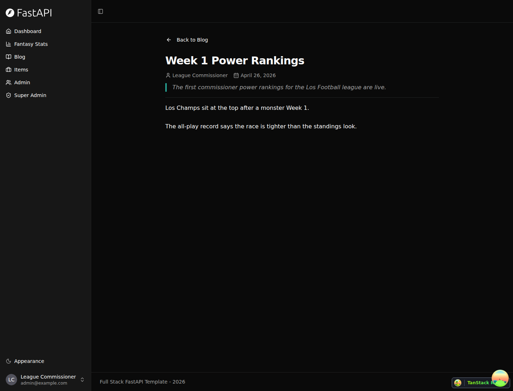
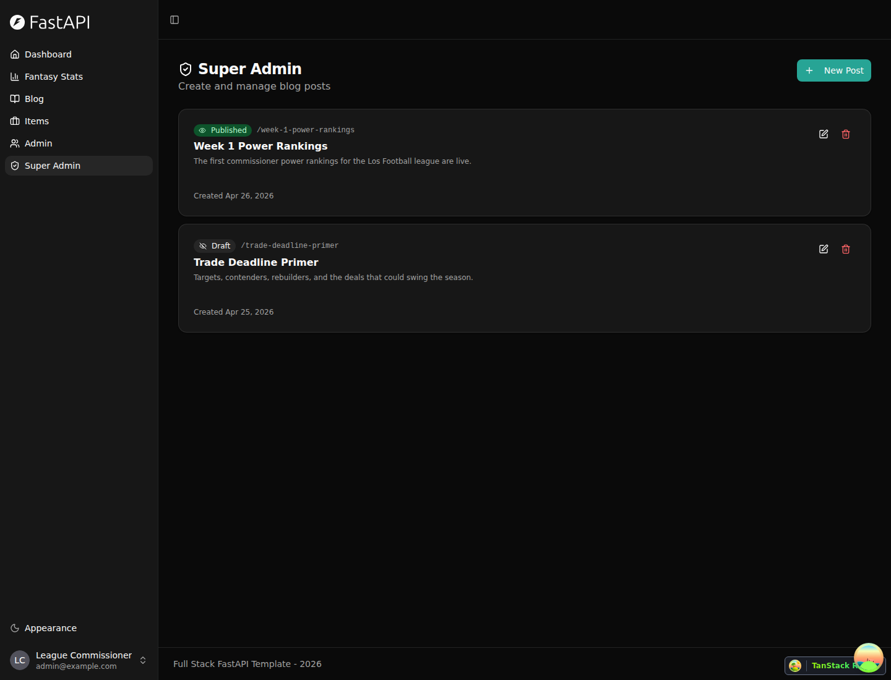
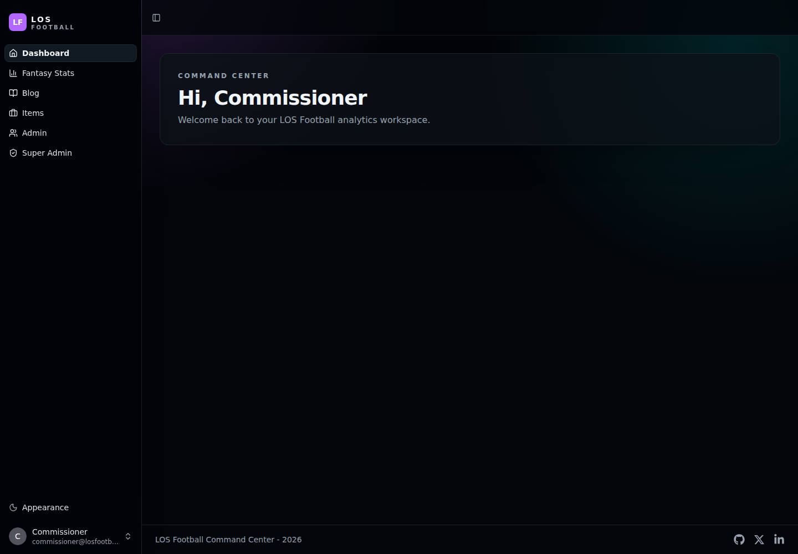

# Los Football

Los Football is a full-stack fantasy football web app built for commissioner workflows, league storytelling, and Sleeper-powered analytics.



## What the app includes

- Sleeper-powered fantasy football stat cards for power rankings, schedule luck, lineup optimization, waivers, draft analysis, trade analysis, playoff outlook, and weekly awards
- A commissioner blog with public post list and detail pages
- A super-admin blog CMS for drafting, publishing, editing, and deleting posts
- Authenticated dashboards, user settings, admin tools, and interactive API docs
- FastAPI backend, React frontend, PostgreSQL, Docker Compose, and Playwright end-to-end tests

## Screenshots

### Login



### Dashboard


### Fantasy Stats

Top 25 advanced fantasy football stat cards powered by the Sleeper API.



### Blog

League news, analysis, and commissioner updates.



### Blog Detail



### Super Admin Blog CMS

Create, edit, publish, draft, and delete commissioner posts.



### Admin Workspace


### Dark Mode



### API Docs


## Tech stack

- **Backend:** FastAPI, SQLModel, PostgreSQL, Alembic, Pydantic
- **Frontend:** React, TypeScript, Vite, TanStack Router, TanStack Query, Tailwind CSS, shadcn/ui
- **Integrations:** Sleeper fantasy football API
- **Auth & security:** JWT auth, password recovery, secure password hashing
- **Tooling:** Docker Compose, Playwright, Pytest, Biome, Ruff, MyPy

## Getting started

### Prerequisites

- Docker and Docker Compose
- Bun for local frontend commands
- Python tooling with `uv` for local backend commands

### Run the full stack with Docker

```bash
docker compose up --build
```

After startup, the main services are available at:

- Frontend: `http://localhost:5173`
- Backend API: `http://localhost:8000`
- API docs: `http://localhost:8000/docs`
- MailCatcher: `http://localhost:1080`

### Local frontend development

```bash
cd frontend
bun install
bun run dev
```

### Local backend development

```bash
cd backend
uv sync
uv run fastapi dev app/main.py
```

## Useful commands

### Frontend

```bash
cd frontend
bun run lint
bun run test
bun run build
```

`bun run test` runs the Playwright E2E suite. Start the required services first
with `docker compose up -d --wait backend`, and make sure
`FIRST_SUPERUSER` and `FIRST_SUPERUSER_PASSWORD` are set so the tests can log
in successfully.

### Backend

```bash
cd backend
uv run pytest
uv run ruff check
uv run mypy .
```

## Project documentation

- Backend setup: [backend/README.md](./backend/README.md)
- Frontend setup: [frontend/README.md](./frontend/README.md)
- Development notes: [development.md](./development.md)
- Deployment: [deployment.md](./deployment.md)
- Release notes: [release-notes.md](./release-notes.md)

## License

This project is licensed under the terms of the MIT license.
